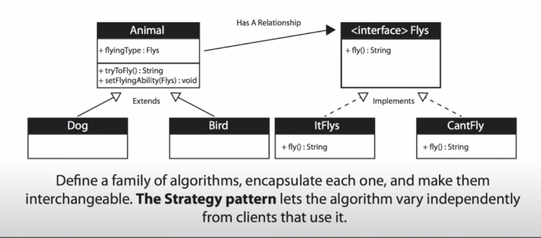
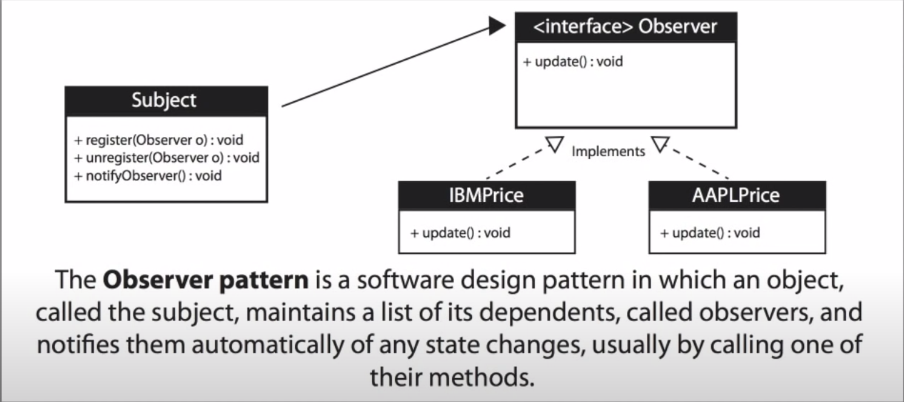
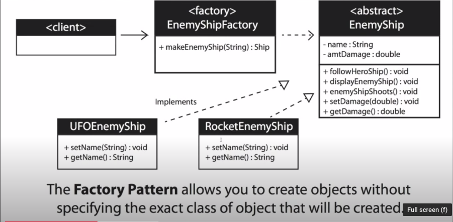

# Table of Contents

1. [Strategy Design Patterns](#sdp)
2. [Observer Pattern](#observer-pattern)
3. [Factory Design Pattern](#factory-pattern)

# Strategy Design Patterns

1. suppose for the existing condition of classes Animal, Bird and Dog, we need to add a method `fly()` to Bird
   1. we can add it to animal, and for all subclasses which are not the bird, return null, or print the message "does not fly".
   2. we can do that either by adding it straightaway to Bird
   3. but if suppose a lot of animals do fly, which are not the subclass of Bird, in that case a lot of **duplicated code** will be created
2. even if we create an interface having a method fly, a lot of duplicate code would be generated for all animals who don;'t fly, the code will predominantly be `I dont't fly` .
3. hence, we do create an interface, but also 2 classes, one which can fly, the another for those that cannot fly
   1. this is called **decoupling**, i.e. we are encapsulating the behaviour of *Flys*
4. instead of the animal/bird/dog class implementing this *Flys* interface in the traditional way, we use this **interface** as an **instance variable** 
   1. this is called **composition** , instead of inheriting an ability through inheritance, the class(animal/bird/dog) itself is composed with objects with the right ability(`itflys` or `cantfly`) built in.
   2. this allows us to change capability of an object at run time.
      1. suppose an animal-subclass(for eg. horse) cannot fly, but through time grows wings, hence is able to fly
      2. or even imagine an opposite scenario, where the animal was able to fly, but then is no longer able to 
      3. thus we would want to dynamically set and change this behaviour.
5. since the instance variable belongs to the interface of **Flys**, it can be either set to *itFlys* or *cantFly*
   1. hence for the animal-subclasses that can fly, we can assign this instance variable a class of *itFlys*
   2. ans for animal-subclasses that can't fly,  we can assign this instance variable a class of *cantFly*
6. UML diagram:
   1. the ***strategy*** here is to actually implement the 2 algorithms `itFlys` and `cantFly` , which is the family of algorithms talked about.
   2. these are **encapsulated** in an interface called `Flys`
   3. the *interchangeability* comes from the instance variable `flyingType` being assigned to either of `itFlys` or `cantFly`.
7. this pattern is used when many classes have one behaviour similar to another behaviour in a list
8. when one of several behaviours is to be used dynamically
9. this often reduces a long list of conditionals, i.e. `if...else` statements.
10. keeps class-change(s) from forcing other class(es) to change.
11. can hide complicated/secret code from the user
    1. since the interface code can be kept hidden
    2. the users need to only know what values can the instance variable have(i.e. just the names `itFlys`  and `cantFly` should suffice), no need to know what both of these algorithms do.
12. 
13. `Flys.java, Dog.java, Bird.java, Animal.java, StrategyPattern.java`

# Observer Pattern

1. when we need to many other objects to receive an update when an object changes
   1. stock market send updates to objects that represent individual stocks
   2. subject(publisher, represents numerous stocks on the stock market) sends many stocks to the Observers
   3. observers(subscribers) takes the ones they want and use them.
2. loose coupling
   1. the subject(publisher) doesn't need to know anything about the Observers(subscribers)
3. The Subject may send updates that don't matter to the Observer.
4. 
5. `StockGrabber` is the one that provides the stocks, and thus sets the stock prices.
   1. update method is called on all observers since in this scenario, all observers have to have only ibm, apple and google stocks, and whenever prices of any of these stocks changes, we need to notify all observers subscribed to this `stockGrabber`.
6. `StockObserver` is an object that subscribes to the StockGrabber, thus could be thought of as a customer buying a stock.
   1. hence the update method is used to make an update for this observer, so that it can know the modified stock prices.
7. `GetTheStock.java` uses the threading.
   1. after deleting observer1, prices for only observer-2 will be printed.
   2. due to the threads, any of the stocks are updated randomly, i.e. the `StockGrabber` object is updated, which then passes on this information to its subscribers, i..e. `observer2`.
8. `GettheStock.java, BehaviourPattern.java, StockObserver.java, StockGrabber.java, Observer.java, Subject.java`

# Factory Design Pattern

1. when a method wants to return one of the many possible sub-classes of a super-class
   1. consider a game where goal = kill all enemies
   2. this pattern will be used to create every new enemy
   3. factory returns an enemy associated to a random-number assigned to that enemy
2. the class is **chosen at runtime**
   1. hence the enemy is dynamically created and returned at runtime
3. when we don't know what object needs to be returned in advance
   1. like in the game, don't know in advance which enemy to call
4. when all of the potential classes are in the same subclass hierarchy
   1. for example, `mini boss` and `final boss` are both sub-classes of the super-class `enemy`
5. to centralise class selection code
6. when you don't want the user to have to know every subclass
7. to encapsulate object creation
8. 
   1. client - main program, like the game.
   2.  the enemyship class is  ***abstract*** 
9. hence the `if...else ` code regarding which enemy ship to choose next is handled by the factory-class itself, and the main game function can be left alone.
10. `UFOEnemyShip.java, RocketEnemyShip.java, BigUFOEnemyShip.java,FactoryDesign.java, EnemyShipfactory.java , EnemyShip.java `